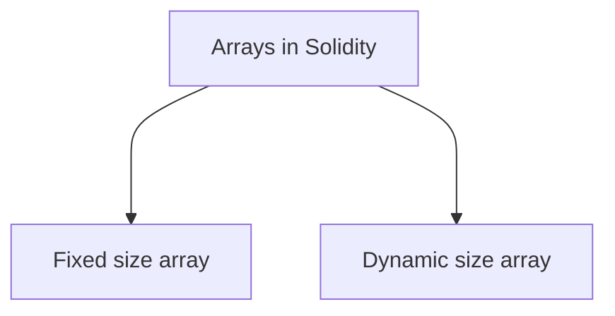
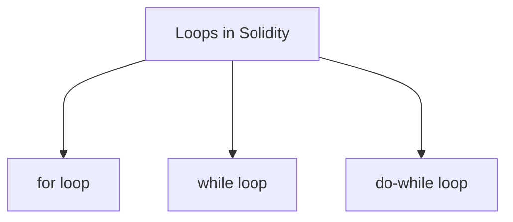

# Solidity Notes
## About Solidity 
- High level statically typed programming language.
- With solidity you can create contracts for uses such as voting, crowdfunding, blind auctions, and multi-signature wallets.
- Case sensetive.
- For latest updates - visit [solidity Documenntation](https://docs.soliditylang.org/en/v0.8.24/)

---
## Basic Solidity Program for Understanding the layout of solidity
The below code haves 3 functions and one object the object defines two variables one is name which is hard coded as "Tanishq" and other is age which is set to 20 but the third function when called increase the value of the age variable by 1.
```solidity
Identity.sol
---
// SPDX-License-Identifier: GPL-3.0

pragma solidity >= 0.5.0 < 0.9.0;

contract Identity
{

    string name;
    uint age;

    constructor() public 
    {
        name="Tanishq";
        age=20;
    }

    function getName() view public returns(string memory)
    {
        return name;
    }

    function getAge() view public returns(uint)
    {
        return age;
    }

    function setAge() public 
    {
        age = age+1;
    }
}
```

---
## State Variable in Solidity 
- Any variable which is defined on the contract level is considered state variable.
- State variable is permanently stored on the *blockchain*.
- Cost Gas - An amount is gas is charged on the state variable *(expensive)*.
- There is no concept of *null or none* in state variable, if the state variable is initialised it contains an pre defined default value.
- If there is a keyword `public` infront of an state variable then the solidity language with bydefault creates an `getter function` for it.
### There are only 3 ways a state variable can be initialised
#### During Declaration
The state variable can be given an value at the time of declaration as shown below.
```solidity
uint public age=10;
```

#### With Constructor
The state variable can also be given value after declaration using an construction within the contract.
```solidity
constructor() public
{
	age=10;
}
```

#### With Setter function
```solidity
function setAge() public
{
	age=10;
}
```
---
## Local Variables
- Local Variables are stored in ==stack== instead on the contract or blockchain.
- Local Variables are declared inside functions.
- Local Variables dont cast gas.
- There are some types that reference the storage by default.
- `string` variables are defined in the contract and outside of the functions but in order to use the `string` inside a function keyword memory is used i.e `string memory name="Tanishq";` and its value is stored inside the memory.
- Memory keyword can't be used at contract level.

```solidity
state.sol
---
// SPDX-License-Identifier: GPL-3.0

pragma solidity >= 0.5.0 < 0.9.0;

contract local
{

function store() pure public returns(uint)
{
	string memory name="Tanishq";
	uint age=20;
	return age;
}
}
```
---
## Functions in Solidity - ***Setters*** and ***Getters***
- When you call a setter function it creates a transaction that needs to be mined and costs gas because it changes the blockchain. Vice versa for getter function.
- By default variable visiblity is private.
- Writing `public` keyword in front of an `state` variable by default creates a getter function for the variable for example `uint public age=10;`
> ==Format of Functions==  
> `Public` means that function is accessible by the external contracts as well  
> `view` means we are just returning the output
```solidity
function <FUNCTION_NAME>() <public/private> <pure/view> returns(<DATAIYPE_OUTPUT>)
{
	// function data
}
```

```solidity
functi.sol
---
// SPDX-License-Identifier: GPL-3.0

pragma solidity >=0.5.0 < 0.9.0;

contract functionLearning
{

    uint age=20; // an state variable
    uint public roll=1337; // an independent getter is created by default cuz of public keyword

    // Getter Function
    function getter() view public returns(uint)
    {
        return age;
    }

    function setter(uint newAge) public
    {
        age = newAge;
    }
}
```
---
## ***Pure*** vs ***View*** in Solidity
- `pure` is used when the function does not read or write with a state variable.
- `view` function is used to interact with the state variable.
- if none is used the compiler will throw ***warning***.

```solidity
pureNview.sol
---
// SPDX-License-Identifier: MIT
pragma solidity >=0.5.0 < 0.9.0;

contract pureNview
{
    uint age = 20; // state variable

    function getAgePure() pure public returns(uint)
    {
        uint otherAge = 10;
        return otherAge;
    }

    function getAgeView() view public returns(uint)
    {
        return age;
    }
}
```
---
## Constructor in Solidity
- Executed only once.
- You can create only one constructor and that is optional.
- A default constructor is created by the compiler if there is no explicitly defined constructor.
- It's used for initialising `state` variable
- It helps to decide the owner of the contract.

```solidity
constructor.sol
---
pragma solidity >= 0.5.0 < 0.9.0;

contract learning_constructor
{
    uint public count;

    // Constructor with no input
    // constructor(){
        // count = 99;
    // }


    // Constructor with input
    constructor(uint new_count){
        count = new_count;
    }
}
```
---
## Integers in Solidity
- `int` contains both positive and negative numbers but uint only contains positive numbers.


---
## Arrays in solidity


### Fixed Size Array
- Array is a collection of data, similar to `list` in python.

```solidity
learning_array.sol
---
// SPDX-License-Identifier: MIT
pragma solidity >= 0.5.0 < 0.9.0;

contract learning_array
{
    uint[4] public arr = [10,20,30,40];

    function setter(uint index_val, uint contain_val) public 
    {
        arr[index_val] = contain_val;
    }

    function length() public view returns(uint)
    {
        return arr.length;
    }
}
```

### Dynamic size array
- It dynamically increases the length of the array.

```solidity
learning_array.sol
---
// SPDX-License-Identifier: MIT
pragma solidity >= 0.5.0 < 0.9.0;

contract learning_array
{
    uint[] public arr;

    function pushElement(uint value) public 
    {
        arr.push(value);
    }

    function popElement() public
    {
        // It will remove the last element of the array.
        arr.pop();
    }

    function length() public view returns(uint)
    {
        return arr.length;
    }
}
```

---
## Bytes Array

### Fixed Size Array
- 1 byte = 8 bits
- 1 hexadecimal digit = 4 bits
- Everything that will be stored in the byte array will be  in the form of hexadecimal digits.
- if all the bytes are not used `null` padding will be added to the bytes.
- Bytes array Immutable in nature.
```solidity
bytes.sol
---
// SPDX-License-Identifier: MIT

pragma solidity >= 0.5.0 < 0.9.0;

contract learning_bytes
{
    bytes3 public b3; // bytes3 array
    bytes2 public b2; //bytes2 array


    function setter() public 
    {
        b3 = 'abc';
        b2 = 'ab';
    }
}
```

### Dynamic Size Array

```solidity
byte.sol
---
// SPDX-License-Identifier: MIT

pragma solidity >= 0.5.0 < 0.9.0;

contract learning_bytes
{
    bytes public b1 = 'abc';

    function pushElement() public 
    {
        b1.push('d');
    }

    function getElement(uint i) public view returns(bytes1)
    {
        return b1[i];
    }

    function getLength() public view returns(uint)
    {
        return b1.length;
    }
}
```
---
## Loops in Solidity



- loops needs to be written under an function.

```solidity
loops.sol
---
// SPDX-License-Identifier: MIT

pragma solidity >= 0.5.0 < 0.9.0;

contract learning_loops
{
    uint[3] public arr;
    uint public count;

	// While Loop
    function whileLoop() public 
    {
        while(count<arr.length)
        {
            arr[count] = count;
            count++;
        }
    }

	// For loop
    function forLoop() public 
    {
        for(uint i=count;i<arr.length;i++)
        {
            arr[count] = count;
            count++;
        }
    }

	// doWhile loop
    function doWhileLoop() public
    {
        do {
            arr[count] = count;
            count++;
        } while(count<arr.length);
    }
}
```

--- 
## if else in solidity

- if else needs to be written inside an function.

```solidity
if_else.sol
---
// SPDX-License-Identifier: MIT

pragma solidity >= 0.5.0 < 0.9.0;

contract ifelselearning
{
    function check(int a) public pure returns(string memory)
    {
        string memory value;

        if(a<0)
        {
            value = "Less than 0";
        }
        else if(a==0)
        {
            value = "Equals to 0";
        }
        else
        {
            value = "Greater than 0";
        }

        return value;
    }
}
```

---
## Boolean Data Type in Solidity

- Holds only two value `true` or `false`.
- `!` logical negation
- `&&` logical conjuction "and"
- `||` logical disjunction "or"
- `==` equality
- `!=` inequality

```solidity
boolean.sol
---
// SPDX-License-Identifier: MIT

pragma solidity >= 0.5.0 < 0.9.0;

contract learningBool
{
    bool public value;

    function check(int a) public returns(bool)
    {
        if(a>100)
        {
            value=true;
        }
        else 
        {
            value=false;
        }
        return value;
    }
}
```
---
## Struct in solidity
- Custom created user controlled data type.
```solidity
structure.sol
---
// SPDX-License-Identifier: MIT

pragma solidity >= 0.5.0 < 0.9.0;

struct Student
{
    uint roll;
    string name;
}

contract LearningStruct
{
    Student public s1;

    constructor(uint _roll, string memory _name)
    {
        s1.roll = _roll;
        s1.name = _name;
    } 

    function changeStudent(uint _roll, string memory _name) public 
    {
        Student memory tmp_student = Student({ roll:_roll, name:_name});

        s1 = tmp_student;
    }
}
```

---
## Enum in Solidity
- giving names to integers starting from 0,1,2...n.
- It is used in small set.
```solidity
enum.sol
---
// SPDX-License-Identifier: MIT

pragma solidity >= 0.5.0 < 0.9.0;

contract learning_enum
{

    enum user{allowed,not_allowed,winner}
    user public u1 = user.allowed;
    uint public lottery = 1000;

    function owner() public {
        if(u1==user.winner){
            lottery = 0;
        }
    }

    function ChangeToWinner() public {
        u1 = user.winner;
    }
}
```

---
## Mapping data structure in solidity
- concept of key and value pairs.
- similar to `dictionary` in python.
```solidity
mapping.sol
---
// SPDX-License-Identifier: MIT

pragma solidity >= 0.5.0 < 0.9.0;

contract learningMapping{

    mapping(uint=>string) public students;

    function setter(uint id, string memory name) public {
        students[id] = name;
    }
}
```
---
## Storage Vs Memory


> In `storage` it points to the actual object in the blockchain
```solidity
// SPDX-License-Identifier: MIT

pragma solidity >= 0.5.0 < 0.9.0;

contract stoVsMem{

    string[] public student = ['Tanishq','Pratham','Jayesh'];

    function mem() public view{
        string[] memory s1=student;
        s1[0] = 'EXPLOIT';
    }

    function sto() public{
        string[] storage s1=student;
        s1[0]='EXPLOIT';
    }
}
```

---
## Mapping struct in solidity
- The key cannot be types mapping, dynamic array, enum and struct.
- The values can be of any type.
- Mapping are always stored in storage irrespective of whether they are declared in contract storage or not.

```solidity
// SPDX-License-Identifier: MIT

pragma solidity >= 0.5.0 < 0.9.0;

contract mappingstruct{
    struct Student{
        string name;
        uint class;
    }

    mapping(uint=>Student) public data;

    function setter(uint _roll,string memory _name, uint _class) public {
        data[_roll] = Student(_name, _class);
    }
}
```

---
## Global Variables

- Pre defined variables in the solidity language with various details regarding the blockchain and smart contracts.

```solidity
// SPDX-License-Identifier: MIT

pragma solidity >= 0.5.0 < 0.9.0;

contract GlobalVariables{

    function getter() public view returns(uint,uint,address){
        return(block.number,block.timestamp,msg.sender);
    }
}
```

---
## Contract Balance

- `payable` keyword when some amount of ether needs to be transfered into that account, to pay to an account.
> The `sendEther` function is not completely working it fails with an error.
```solidity
// SPDX-License-Identifier: MIT

pragma solidity >= 0.5.0 < 0.9.0;

contract PayingApplication{

    address payable user = payable(0xAb8483F64d9C6d1EcF9b849Ae677dD3315835cb2);

    function sendEther() public{
        payable(user).transfer(1 ether);
    }
    
    function payEther() public payable{

    }

    function getBalance() public view returns(uint){
        return address(this).balance;
    }
}
```

---
## Public , Private , Internal & External

| Public | Private | Internal | External |
| ---- | ---- | ---- | ---- |
| Outside | X | X | Outsider |
| Within | Within | Within | X |
| Derived | X | Derived | Derived |
| Other | X | X | Other |
```solidity
// SPDX-License-Identifier: MIT
pragma solidity >= 0.5.0 < 0.9.0;

contract A{

    function f1() public pure returns(uint){
        return 1;
    }

        function f2() private pure returns(uint){
        return 2;
    }

        function f3() internal pure returns(uint){
        return 3;
    }

        function f4() external pure returns(uint){
        return 4;
    }
}

contract B is A{

    uint public bx = f3();
}

contract C{
    A obj = new A();

    uint public cx = obj.f4();
}
```

---
